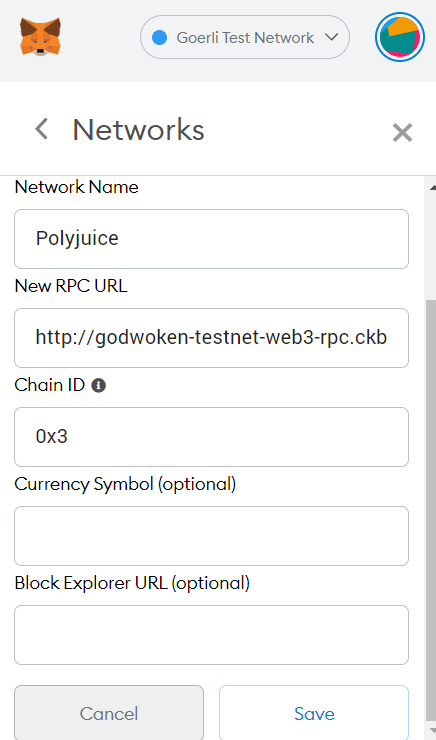

# 3. Issue a smart contract call to the deployed smart contract

## 1. Change your MetaMask setting to custom network with Godwoken testnet Polyjuice chain.

```sh
Network Name: Polyjuice
New RPC URL: http://godwoken-testnet-web3-rpc.ckbapp.dev
Chain ID: 0x3
```




## 2. write a small js script using `web3.js` to call your contract

```javascript
var Web3 = require('web3');
const web3_rpc_url = "http://godwoken-testnet-web3-rpc.ckbapp.dev"; 
web3 = new Web3(new Web3.providers.HttpProvider(web3_rpc_url));

var abi = '<your contract abi>';
var addr = "<your contract address>";

var myContract = new web3.eth.Contract(abi, addr);
myContract.methods.FUNCTION_NAME().call().then(console.log);
```
