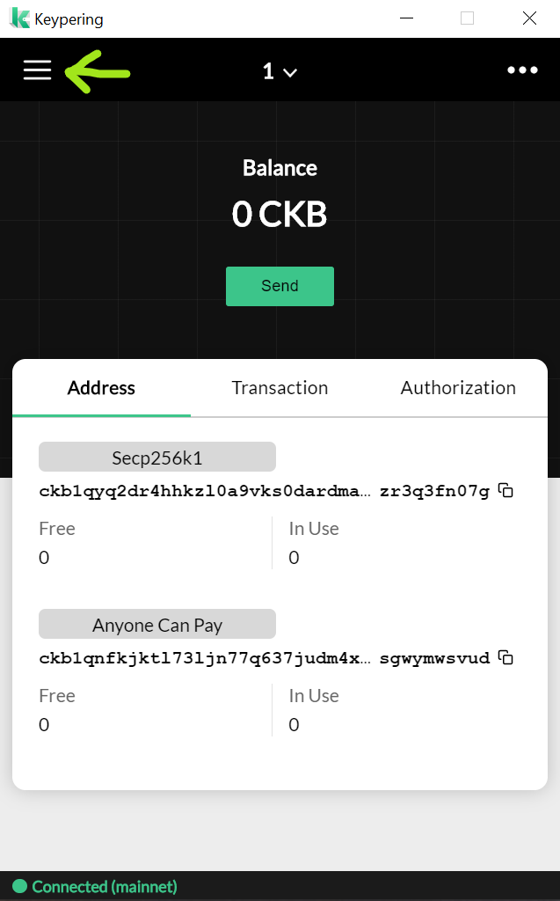
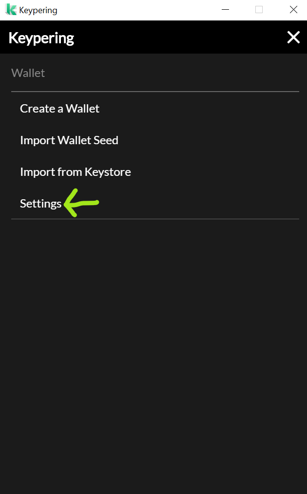
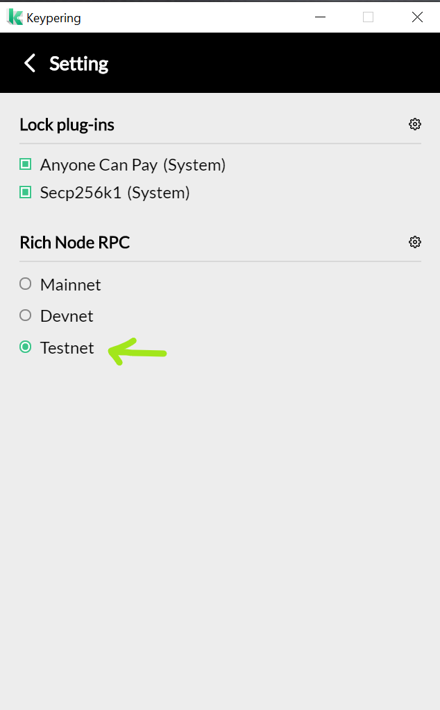
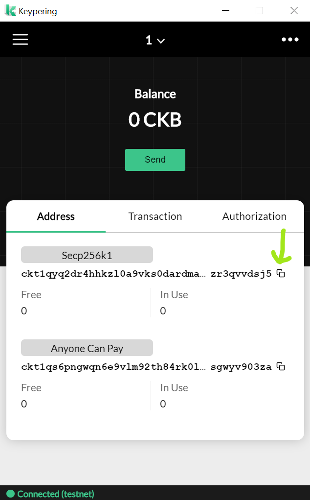

# Setup Keypering with Funds on Testnet

Keypering is a wallet that gives you access to Nervos ecosystem. You can use it to hold native Nervos token (CKB) as well as tokens (SUDT). One of the main Keypering features is also being able to connect with various web applications living on Nervos layer one. Such applications will ask you for permission to connect to your wallet and later - to confirm transactions. Example application is Thunder Issue dapp which can be issued for creating your own tokens!

**Introduction**

During the process decribed below we will download correct Keypering setup binary for our operating system and we will proceed with installing it.

When the wallet is installed we will get some free funds from testnet faucet to get us started!

## 1. Download [Keypering](https://nervosnetwork.github.io/keypering/#/)

1. Go to https://github.com/nervosnetwork/keypering/releases, choose latest release and download correct binary for your operating system (Mac OSX .dmg, Windows .exe, Linux .AppImage).

2. Install the downloaded binary file and start the Keypering wallet.
3. Go through the process of creating or importing the wallet.

4. Now we have to switch our wallet to testnet mode. Click settings icon in top left.

## 2. Get testnet CKB from faucet

Copy address from Keypering wallet. It should start with "ckt" prefix. If it doesn't make sure you changed Keypering setting called "Rich Node RPC" to Testnet in step 1.

### Faucet

Now you can go to the testnet faucet - https://faucet.nervos.org/ - where you can get some funds 

Paste your wallet address into big "Enter your Aggron wallet address" input box. The address is the one that you copied from the Keypering wallet earlier.

When the input box is filled click "Claim" button. Your transaction will become pending and you should receive funds shortly. It usually takes up to few minutes. After this transaction completes you will be ready to go.

Transaction is first in pending state:

Then it completes:

As you've seen above you can follow receiving funds progress on the website.

When the transaction is finally done you should see an increased balance in your wallet. These are your testnet funds ready to use! Enjoy!

Remember you can always come back here when you need funds again. One thing to note though is after requesting funds you need to wait 24 hours to request the funds again to the same CKB address.