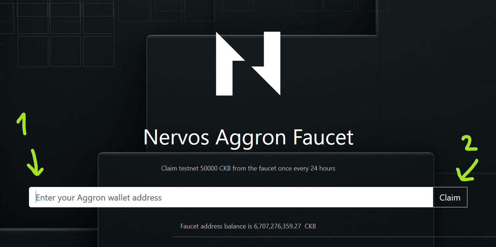

# Setup a Nervos CKB Layer 1 Account with CKBytes

## Table of Contents

1. [Introduction](#introduction)
2. [Install ckb-cli](#install-ckb-cli)
3. [Create a Layer 1 Account](#create-a-layer-1-account)
4. [Get Free Testnet CKBytes from the Faucet](#get-free-testnet-ckbytes-from-the-faucet)
5. [Check Your Account Balance](#check-your-account-balance)
6. [Export private key](#export-private-key)
7. [Read private key](#read-private-key)

## Introduction

Nervos Network is a multi-layer blockchain. Layer 1 is concerned with security and decentralization, while layer 2 is concerned with scalability. On Nervos, EVM compatibility is provided in a layer 2 execution environment which allows for high TPS throughput that inherits the security and decentralization of layer 1. These two layers work together to provide an optimally performant and safe environment for all users.

Our focus is on layer 2, but the process still begins on layer 1. We will start by creating an account on layer 1, funding it with some Testnet CKBytes, then exporting our private key so we can use it for the next step.

To create an account on layer 1 we will use the ckb-cli command-line tool. All of our examples use Linux.

## Install ckb-cli

The first thing we need to do is download and install the `ckb-cli` command line tool. There are several ways this can be done, but our instructions will install it the `projects` directory within the user's home folder.

Creating the `projects` directory is optional, but it may be helpful for organization since we will be installing more tools later. We will also be adding `ckb-cli` to the `PATH` so it can be used from any folder, but this is also purely optional.

Open a terminal and execute the commands below to create the `projects` folder, download the `ckb-cli` binary, and decompress it:

```sh
cd ~
mkdir projects
cd projects
curl -O https://github.com/nervosnetwork/ckb-cli/releases/download/v0.43.0/ckb-cli_v0.43.0_x86_64-unknown-linux-gnu.tar.gz -L
tar -xvzf ckb-cli_v0.43.0_x86_64-unknown-linux-gnu.tar.gz
mv ckb-cli_v0.43.0_x86_64-unknown-linux-gnu ckb-cli-0.43
```

The `ckb-cli` application now exists in the `~/projects/ckb-cli-0.43` directory, and you can execute it by running `~/projects/ckb-cli-0.43/ckb-cli`.

Next, we will add `ckb-cli` to system path so we can execute it by simply typing `ckb-cli` from anywhere without the full path.

To do this, we need to edit our shell run commands file.

If you use bash:

```sh
nano ~/.bashrc
```

Or if you use Zsh:

```sh
nano ~/.zshrc
```

Different distributions of Linux may use different files, so you may have to consult the documentation if one of those files isn't correct.

In your editor, add the following line to the bottom:

```sh
export PATH=$HOME/projects/ckb-cli-0.43:$PATH
```

Note: The line above assumes you used the `~/projects/ckb-cli-0.43` path from the previous step. If you used a different path, make sure you adjust this accordingly.

Restart your terminal to apply the changes, then start `ckb-cli` by typing:

```sh
ckb-cli
```

Once `ckb-cli` starts, you should see something similar to this:

```txt
  _   _   ______   _____   __      __   ____     _____
 | \ | | |  ____| |  __ \  \ \    / /  / __ \   / ____|
 |  \| | | |__    | |__) |  \ \  / /  | |  | | | (___
 | . ` | |  __|   |  _  /    \ \/ /   | |  | |  \___ \
 | |\  | | |____  | | \ \     \  /    | |__| |  ____) |
 |_| \_| |______| |_|  \_\     \/      \____/  |_____/

[  ckb-cli version ]: 0.43.0 (aa18f6c 2021-06-22)
[              url ]: http://127.0.0.1:8114 (network: Dev)
[              pwd ]: /home/username/projects/ckb-cli-0.43
[            color ]: true
[            debug ]: false
[          no-sync ]: false
[    output format ]: yaml
[ completion style ]: List
[       edit style ]: Emacs
[   index db state ]: Waiting for first query
```

This text indicates that `ckb-cli` is running in interactive mode. You can continue to execute the following commands in interactive mode, but the commands will also work directly from the command line, which we will start with. Type `exit` and press enter to leave the interactive `ckb-cli` session and return to the command line.


## Create a Layer 1 Account

The `ckb-cli` tool includes basic wallet functionality, and we will use it to generate an account with a CKB address.

Run following command to generate a new account:

```sh
ckb-cli account new
```

You will then be prompted to enter a password to secure your account. Be sure to pick a password that you're going to remember later on. Type password into the tool and press "Enter". Then repeat the password and press "Enter" again.

After the action is done you should see the output similar to this:

``` sh
address:
  mainnet: ckb1qyq9u5vzgtklnqrr6cevra7w2utrsxmjgefsr0wk7q
  testnet: ckt1qyq9u5vzgtklnqrr6cevra7w2utrsxmjgefs72sfju
lock_arg: 0x5e518242edf98063d632c1f7ce5716381b724653
lock_hash: 0x5c7253696786b9eddd34e4f6b6e478ec5742bd36569ec60c1d0487480ba4f9e3
```

Nervos provides two types of addresses, one for use on the Mainnet, and another for use on the Testnet and also on Devnets. We will only be working with the Testnet address since we are working with the Testnet.

Make note of the Testnet address since this will identify your account on Nervos Layer 1, and we will need it later. Congratulations! You've just created your first Nervos account. 👏

The next step is to setup your Layer 1 account with funds. You will need to get some free Testnet CKBytes so you can perform actions on Nervos.

## Get Free Testnet CKBytes from the Faucet

Now you can go to the testnet faucet - https://faucet.nervos.org/ - where you can get some funds. 



Paste your wallet address into big "Enter your Aggron wallet address" input box. The address is the "testnet" entry from creating new account command.

Example testnet address is: ckt1qyq9u5vzgtklnqrr6cevra7w2utrsxmjgefs72sfju (don't use this one, use the one you created)

When the input box is filled click "Claim" button. Your transaction will become pending and you should receive funds shortly. It usually takes up to few minutes. After this transaction completes you will be ready to go.

Transaction is first in pending state:


Then it completes:


As you've seen above you can follow receiving funds progress on the website.

## Check Your Account Balance

When the transaction is finally done you should see an increased balance in your wallet. To check the balance in ckb-cli use the following command:

```txt
ckb-cli wallet get-capacity --address YOUR_TESTNET_ADDRESS
```

As the result of this command you should see that the capacity (CKB) in your wallet has increased after you requested funds from faucet. It can take some time for the funds to show up.

If the output of the command is something like:

```txt
total: 10000 (CKB)
```

Then it means you've performed the actions correctly. These are your testnet funds ready to use! Enjoy!

*Tip: Remember you can always come back to the faucet when you need funds again. One thing to note though is after requesting funds you need to wait 24 hours to request the funds again to the same CKB address.*

## Export Your Private Key

The private key gives access to your funds.

Exporting private key is something you should be very cautious about. You should never share your private key with someone else. 

In this example though if we want to use other tools - for example to create account on Layer 2, deploy smart-contracts and interact with them - these tools need to access your funds to perform operations for you. Since we're on testnet it's all for testing purposes and the funds have no value, so it's safe to do.

Export private key (you can get lock arg when you imported your account):

```sh
ckb-cli account export --lock-arg <YOUR_LOCK_ARG> --extended-privkey-path /home/<YOUR_USERNAME>/privkey.txt
```

- Replace `<YOUR_LOCK_ARG>` with the lock argument for your account. When you created account one of the values from output was `lock_arg`. Use it here. Example value: `0x5e518242edf98063d632c1f7ce5716381b724653`
- Replace `<YOUR_USERNAME>` with the name of the user on your machine. You can also replace whole value of `--extended-privkey-path` if you would like to export private key to some other location. Make sure you can read the value of the file later though.

After you run the command above you will be asked for the password to your account. Make sure you remember it. Type it and press "Enter".

You should see a success message:

```txt
message: "Success exported account as extended privkey to: \"/home/kuzi/privkey.txt\", please use this file carefully"
```

Screenshot:


## Read private key

Now after you've exported the private key you can read it and copy it to other applications where it's needed. For example you can use `cat` to read the file, or you can open it in any text editor to see its content.

Command:

```txt
cat /home/kuzi/privkey.txt
```

Results in:

```txt
79682c20bbcaf7fcf18eb0c69b133c872227ceb88971090e7f2242c80cd54d18
f8a4586790460d7cd8eb389af4cd1b0cfc9903b5d4b88b9eedb8fb9c150c4c88
```

If you see a `%` at the end - ignore it. It just marks the end of file.

The first line of this file is your private key. Prefix it with 0x to mark it as hex string.

For now ignore the other part of the file. It's chain code for BIP44 standard but you don't need it for this use case.

In this case final private key would be:

```txt
0x79682c20bbcaf7fcf18eb0c69b133c872227ceb88971090e7f2242c80cd54d18
```

Congratulations, you're ready to use it with other apps!
