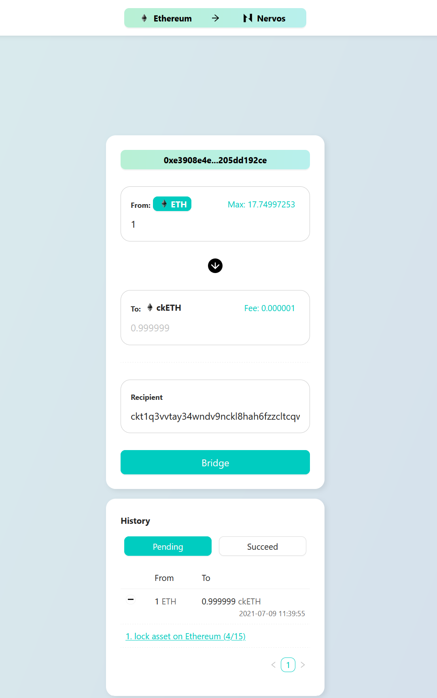
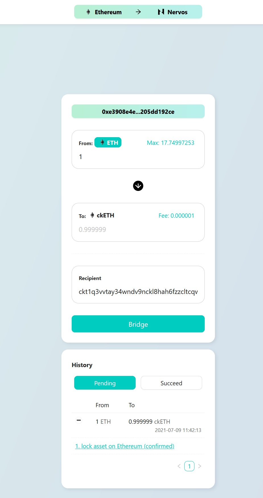
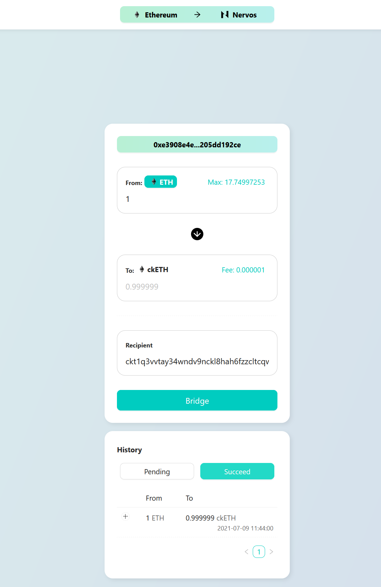

# 6. Use Force Bridge to Deposit Tokens on Ethereum to Polyjuice

Moving assets between blockchains is an extremely important part of building cross-chain applications. Nervos is heavily betting on cross-chain future, that's why in its ecosystem you can find tools such as Force Bridge. It already allows moving tokens between Ethereum and Nervos! Cardano bridge has been already announced by both companies and is in the works. There will be also other networks plugged in. The future looks interesting.

Alright, lets get back to the present. In this tutorial you will bridge Rinkeby ETH to ckETH on Nervos Layer 2. ETH is a native asset on its own chain but you will receive it wrapped as SUDT token on Nervos Layer 2. This is because there is already a native asset on Nervos Layer 2 and it is testnet CKB (native Nervos currency).

## Requirements

Before starting, you will need to setup your development environment. For information about setup and requirements please [review this article](../tasks-setup-and-requirements/tasks-setup-and-requirements.md).

## Task Instructions

> Note: Before you complete the tasks, be sure to review the [Task Submission](#task-submission) section so you know what materials you will need to provide to judges to review your task submission.

You will use already existing Force Bridge testnet webpage to bridge Ethereum currency from Rinkeby to Nervos L2. In this tutorial you will need to send transaction from MetaMask using Rinkeby network. Make sure your account is setup on Rinkeby and you have Rinkeby testnet funds.

### 1. Setup MetaMask account on Rinkeby

Install MetaMask, create account and use [Rinkeby faucet](https://faucet.rinkeby.io/) to get funds.

### 2. Calculate your deposit receiver address

Due to uniqueness of Nervos architecture there is a special address you can use for your funds to almost directly land on Layer 2. Each time native currency or token is transferred to this address, Layer 2 block producer will collect it and deposit it to the corresponding Ethereum address on Layer 2. We call this special address Layer 2 deposit address. It lives on Layer 1 (and begins with ctk...) but it acts as a portal.

To obtain Layer 2 deposit address you can use existing JavaScript code that we've prepared for you. It is located in [`src/examples/6-bridge/index.js`](../examples/6-bridge/index.js) script. Fill your Ethereum address to receive asset to (replace the `<YOUR_ETHEREUM_ADDRESS>` value) in the JavaScript code first before running the program.

After you've placed your address in code run:
```sh
cd src/examples/6-bridge
node index.js
```

<details>
    <summary>Example Output</summary>

```
➜ node index.js 
Using Ethereum address: 0xD173313A51f8fc37BcF67569b463abd89d81844f
Corresponding Polyjuice address: 0xa3cd0b1d997e5281dd574dd34155945febcf73a4

Deposit to Layer 2 address on Layer 1: 
ckt1qs4vva27537dzxxpgle3vq5jjgfd8x2ye3dynmqj7c78z3vmuzve4xexq9s7qquh9s9knxfehstyelw0eelagr4ezdvr2qyd6lsf60dw5yqqqqqsqqqqqvqqqqqfjqqqqp303zade957p346euv9lgwy2zhpj6d0tkdhsgchl8kdnvhantykq6gqqqqpqqqqqqcqqqqqxyqqqq8u7zf6tuwlgqmuagje6jwlqp0quujcknmrueer8md9kdmt0lfzjqqngqqqqzdjvqtpuqpewtqtdxvnn0qkfn7ulnnl6s8tjy6cx5qgm4lqn576a5tnxya9r78ux770vatfk336hkyasxzy7q9rqgqqqqqqcq7pq9ye
```
</details>

The last part of the console output from running the above script is your Layer 2 deposit address. It has been generated specifically for the Ethereum address you've passed. If you change the Ethereum address, the deposit address will change too. Copy the value you've received, you will use it in the next step to fill the recipient value of the transfer on the bridge website.

### 3. Go to [Force Bridge Testnet website](https://force-bridge-dev.ckbapp.dev/bridge/Ethereum/Nervos?xchain-asset=0x0000000000000000000000000000000000000000) to initiate a transfer

Make sure you have Rinkeby network selected in MetaMask. To use the bridge you also need Rinkeby ETH. You can get it from Rinkeby faucet.

You should bridge from ETH to ckETH. If ETH isn't already selected as the source asset then click "Select" button next to "From" and choose "ETH" from the list.


After you've selected the asset you want to bridge, input the amount of the transferred funds. Received amount below will be automatically recalculated and you can't change it. There will be also a small fee to the transfer, so the transferred asset amount won't be exactly the same as you've entered.

In the next step change the `Recipient` address to the one which you already caculated from step 1. This will make sure that when your bridged transaction is complete it will be automatically collected by Layer 2 operator and your ckETH balance on Layer 2 will increase.

When you've entered all the details then click `Bridge` button. You will be asked to sign a MetaMask transaction. This transaction is going to send Rinkeby ETH to the bridge, so you can later receive it on Layer 2.


When you confirm the transaction in the MetaMask you will get a modal with a link to Etherscan, where you can see the progress of mining your transaction on the Ethereum chain.


You will also see the transaction in **History** section of the UI in the **Pending** tab. First it will be in "lock asset on Ethereum (x/15)" state, where X is the number of block confirmations on the Ethereum chain. It has to have at least 15 confirmations:



When there is at least 15 block confirmations your pending transaction will transition to "lock asset on Ethereum (confirmed)" state:



It doesn't mean the whole transfer through the bridge is complete, because this is a two-step process. Ethereum transaction was just the first part. Now bridge will send transaction on Nervos Layer 1 so your funds are visible as SUDT. When this happens your transaction will move to "Succeed" tab:



At this point there is one last step, but you don't have to do anything. Nervos Layer 2 operator has to collect the funds from Layer 1 and deposit it into Layer 2 for you. It will happen automatically, and after this process you should see your token balance increased. It can take up to 10 minutes though in normal conditions.

## Task Submission

To complete the tasks, you will need to submit the following materials for review by the judges:

1. Ethereum address that you've sent Rinkeby ETH from.
2. Ethereum address that you've used to generate deposit address (it could be the same as 1).

## Do you want to check your Layer 2 balance?

If you want to check your Layer 2 token balance now to confirm you've received the SUDT you can deploy SUDT-ERC20 proxy contract with SUDT ID: `142` (ckETH) and then check the balance. [You can find instructions how to do so in the previous task.](./5.deploy.erc20.proxy.contract.md) We encourage you to do so because then you'll be able to confirm the asset has safely arrived in your account!

> Note: Do you see how all tasks play together to create a full blockchain application lifecycle? :)